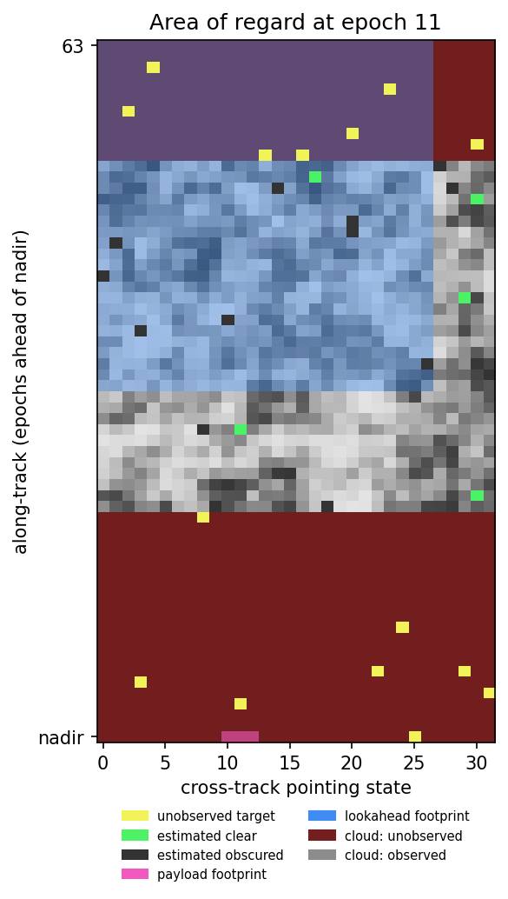

# cadet — Cloud-Aware Dynamic Earth-observation Tasking

An implementation of **"Energy-Aware Dynamic Tasking for Earth Observing Satellites
with Deep Reinforcement Learning"** (Nordlund, Upthegrove & Tassiulas, SSC26-IX-06,
40th Annual Small Satellite Conference).

An agile Earth-observing satellite carries two body-fixed sensors: a narrow **payload
sensor** that images ground targets and a wide **lookahead sensor** that measures cloud
cover ahead of the ground track. Because both are body-fixed they point together, so the
spacecraft must choose between gathering information about clouds and committing to
captures that may turn out to be obscured — all while drawing on a limited power budget.

The paper formulates this as a **constrained POMDP** and solves it end-to-end with deep RL
instead of the usual sequential *look → replan → capture* decomposition. This repo
implements the environment, the cloud-visibility model, both controllers, both baselines,
and the evaluation protocol.

---

## What's here

| Module | Contents |
|---|---|
| [`cadet/clouds.py`](src/cadet/clouds.py) | Latent Gaussian random field cloud model (Appendix A.1); circulant-embedding sampler; Monte-Carlo evaluation of the point-to-block discrepancy variance σ²_A (Eq. 10) |
| [`cadet/visibility.py`](src/cadet/visibility.py) | The closed-form conditional visibility model of **Proposition 1** |
| [`cadet/env.py`](src/cadet/env.py) | The CPOMDP as a Gymnasium environment: scrolling 64×32 area of regard, 32 roll states, joint `(a_move, a_sense)` actions |
| [`cadet/planner.py`](src/cadet/planner.py) | Exact dynamic-programming SSP solver — used for both baselines and as CADET-Plan's `delegate` action |
| [`cadet/policies.py`](src/cadet/policies.py) | The ~2.2M-parameter CNN actor–critic encoder |
| [`cadet/lagrangian.py`](src/cadet/lagrangian.py) | Primal–dual constrained RL: augmented reward, dual ascent on λ, budget-slack curriculum |
| [`cadet/baselines.py`](src/cadet/baselines.py) | The `SSP` (no cloud knowledge) and `Oracle` (perfect cloud knowledge) bounds |
| [`cadet/train.py`](src/cadet/train.py), [`cadet/evaluate.py`](src/cadet/evaluate.py), [`cadet/experiments.py`](src/cadet/experiments.py) | Training, the paper's evaluation protocol, and the 24-cell sweep |

---

## Install

```bash
pip install -e ".[dev,logging]"
```

For GPU training, install a CUDA build of PyTorch first. This matters enormously: measured
end-to-end PPO throughput is **2 fps on the CPU wheel versus ~360 fps on an RTX 3050**, a
180× difference that decides whether training is possible at all.

```bash
pip install torch --index-url https://download.pytorch.org/whl/cu126
```

## Quick start

```bash
python -m cadet.train --controller cadet-plan --lookahead 32 --budget 150 --timesteps 200000
```

```bash
python -m cadet.evaluate runs/cadet-plan_n32_P150/model.zip --controller cadet-plan --lookahead 32 --budget 150
```

```bash
python -m cadet.experiments --profile quick --results results/sweep.json
```

```bash
python scripts/make_figures.py --figures 2 3
```

Training writes `runs/<name>/progress.csv` with every logged metric per rollout. To see how
a run actually went:

```bash
python scripts/plot_training.py --run runs/cadet-plan_n32_P150 --csv history.csv
```

That produces a six-panel diagnostic — reward against the baselines, capture accuracy, the
power constraint against its curriculum threshold, the dual variable λ, policy entropy, and
value-function fit — plus a tidy CSV. It also reads a captured stdout log via `--log` for
runs that predate CSV logging.

---

## The model

### Cloud field

Cloud cover is a transformed latent Gaussian random field (Appendix A.1):

```
Z(p)  ~  GRF, zero mean, unit variance, Matérn(ν = 0.5, ℓ = 10 km)
Z̃(p)  =  α Z(p) + β                     α = 2.0, β = 0.8
Y(p)  =  sigmoid(Z̃(p))                  a target is visible iff Y(p) < τ = 0.5
```

`Φ(−β/α) ≈ 0.345` of the surface is cloud free, matching the ~67% global mean cloud
fraction. The field is sampled by **circulant embedding** (Dietrich–Newsam) on a sub-cell
grid four times finer than the AoR raster, so that lookahead pixels at every FOV land on
integer block boundaries.

### Proposition 1 — visibility under lookahead uncertainty

The lookahead sensor measures the **block average** `Y_A`, never the pointwise value that
determines whether a capture succeeds. The probability the target is clear is

```
Pr(Y(p) < τ | Y_A)  ≈  Φ( (logit(τ) − logit(Y_A)) / σ_A )
```

parameterised **only** by σ_A, the point-to-block discrepancy standard deviation:

```
σ²_A = k̃(0) − E_{U,V ~ Unif(A)}[ k̃(‖U − V‖) ],     k̃(r) = α² k(r)
```

A lookahead sensor images an `n`-column footprint onto a fixed 32-pixel raster, so a
narrower FOV buys sharper ground pixels — `L = n · 250/1024` km — and therefore a more
decisive visibility estimate. This is the coverage-vs-fidelity trade-off that makes
performance saturate beyond `n = 32`.

`tests/test_visibility.py::test_calibration_against_a_simulated_field` checks the model is
genuinely *calibrated* against simulated fields, not merely monotone.

### The CPOMDP



**Observation** — an 8-channel `64 × 32` image over the area of regard:

| Ch | Contents |
|---|---|
| 0 | Sensor geometry: payload footprint (1.0) and lookahead footprint (0.5) |
| 1–4 | Target counts: total, unobserved, estimated clear, estimated obscured |
| 5 | Belief `Pr(Y(p) < τ)` per target — Proposition 1 where measured, the prior elsewhere |
| 6 | Block-averaged cloud measurements acquired so far |
| 7 | Binary observation mask (distinguishes *unobserved* from *measured as clear*) |

**Action** — `MultiDiscrete([|A_move|, 3])`, sampled as two independent categoricals from
one concatenated logit vector, so maneuvering and sensing are chosen *jointly*:

- `A_sense = {noop, lookahead, payload}`
- `A_move = {noop, roll-left, roll-right}` — plus `delegate` for CADET-Plan

**Reward** — the number of *cloud-free* targets in the payload footprint at nadir. Capturing
an obscured target earns nothing but still costs 750 power units.

**Constraint** — power costs are roll 36, lookahead 200, payload 750, planner 18, enforced
as a discounted budget `J_c(π) ≤ μ·P̄` with `μ = 1/(1−γ) = 100`, which permits short bursts
while holding long-run consumption to `P̄`.

### CADET-Plan

The `delegate` action hands maneuvering to the exact SSP dynamic program, run over the
64-epoch AoR horizon with **task utilities set to the agent's current beliefs** — the
Proposition 1 probabilities where a lookahead measurement exists, the `≈1/3` prior
elsewhere. It returns the first roll command; on the next epoch the agent may delegate
again (folding in any new observations) or steer itself. The same probabilistic model
therefore drives both the observation channels and the planner's objective.

Because the roll axis is discrete with a one-state-per-epoch slew limit, an
agility-feasible plan is exactly a path through the `(epoch, pointing state)` lattice, and
each target has one access time — so the DP is **exact**, not a heuristic.
`tests/test_planner.py` verifies it against brute-force enumeration.

### Constrained training

Policy updates maximise the augmented reward `r̃ = r − λ·c` under PPO, while λ follows
projected dual ascent on a Monte-Carlo estimate of the discounted constraint return:

```
λ ← [ λ + η ( Ĵ_c − μ·P̄·s ) ]₊
```

A curriculum holds the slack at `s = 5` for the first 1M steps and tapers it to 1 over the
next 10M, so the policy learns that lookahead sensing pays off before the budget bites.

---

## Verified against the paper

Reproduced without any training, from the models alone:

| Quantity | Paper | This implementation |
|---|---|---|
| Cloud-free surface fraction | ~0.34 | 0.343 |
| SSP baseline (3,000-epoch episodes) | ~194 | 210.6 |
| Oracle baseline | ~295 | 290.0 |
| SSP capture accuracy | 0.35 | 0.357 |
| Policy parameters | ~2.2M | 2,157,224 (CADET-Plan); 2,156,967 (CADET) |
| σ_A for n = 8/16/32/64 | 0.58 / 0.79 / 1.07 / 1.38 | 0.62 / 0.85 / 1.13 / 1.45 |

The σ_A row is ~6% high; see [`docs/reproduction-notes.md`](docs/reproduction-notes.md), whose claims cite evidence from individual [training runs](docs/runs/README.md).

### Checking this yourself

Everything above is re-derived from scratch by one script — no trained policy, no GPU:

```bash
python scripts/verify.py
```

It runs 18 checks in about 30 seconds, in three groups:

- **Paper values** recomputed from the models — cloud-free fraction, the four σ_A
  values of Figure 3, both baselines, capture accuracy, parameter count.
- **Internal correctness** against independently computed ground truth — the SSP dynamic
  program is checked against *brute-force enumeration* of every agility-feasible path,
  and Proposition 1 is checked for **calibration** (among targets assigned probability
  p, a fraction ≈p really are clear) rather than mere monotonicity. It also replays each
  baseline's own trajectory back through `env.step()` and requires the reward to match
  the offline score exactly — the baselines are scored offline while a trained policy is
  scored online, so the two accountings must agree or every gap-closure number would be
  comparing unlike quantities.
- **Negative controls** — random < SSP < Oracle with a non-trivial gap, σ_A → 0
  collapsing to a hard threshold, the no-information prior landing at 0.5, and σ_A
  increasing with field of view.

`--quick` runs the same checks in ~5 s with fewer samples. A non-zero exit code means
something regressed.
Pass `--paper-sigma` anywhere to pin the printed values instead.

**Learned-controller results are not reproduced here.** No policy in this repo has been
trained beyond a smoke run. The paper's central claims — CADET closing 42% of the SSP→Oracle
gap and CADET-Plan 56%, plus Tables 1–4 and Figures 4–6 — are therefore **unvalidated**: the
apparatus that would test them is built and verified, but it has not been run at a scale
where learned behaviour could confirm or refute them. See *Compute* below.

---

## Compute

The paper trains 24 configurations for 30M timesteps each. Measured end-to-end on an RTX
3050 laptop (20 CPU cores) with `n_envs=8` and everything else at Table 5 defaults:

| | sustained throughput | 30M timesteps |
|---|---|---|
| CADET | 502 fps | **16.6 h** (measured) |
| CADET-Plan | 322 fps | ~25.9 h (extrapolated) |
| Full 24-cell grid | | **~21 days** |

The CADET figure is a completed 30M run, not an extrapolation. Note that CADET-Plan is
**1.6× slower**: once its policy learns to delegate it invokes the DP planner on essentially
every step. Short benchmarks understate this badly — measured over the first 60k timesteps,
before the policy has learned to delegate, the two controllers appear equally fast. Any
throughput number for CADET-Plan taken from an untrained policy is wrong.

Two further consequences:

- **`--subproc` is slower here** (278 fps), because IPC overhead on `8×64×32` observations
  exceeds what parallel env stepping buys back. Leave it off unless you enlarge the AoR.
- Speed comes from the GPU and from batch size, not from more environment workers.

A full paper-scale sweep therefore wants a datacentre GPU or a multi-machine split.
`--profile quick` (2M timesteps, ~1.5 h/cell) is the right setting for confirming that
learning proceeds; `--profile smoke` is for CI.

```bash
python -m cadet.experiments --profile smoke --lookahead 32 --budgets 150   # minutes, CI-scale
python -m cadet.experiments --profile quick                                # the full grid, reduced
python -m cadet.experiments --profile paper --device cuda                  # as published
```

The sweep writes incrementally to `results/sweep.json` and skips cells already recorded, so
it can be interrupted and resumed.

---

## Tests

```bash
python -m pytest
```

140 tests covering the kernel and GRF sampler (empirical correlation and variance against
the specified Matérn), visibility calibration, the DP against brute force, environment
dynamics and the Gymnasium API, baseline ordering, and the dual-ascent fixed points.

---

## Deviations from the paper

- **Constraint costs are normalised by `P̄`** before accumulation, making the threshold
  simply `μ` and keeping `η = 10⁻³` meaningful across budgets that span 15×. Set
  `PowerConfig(normalise_by_budget=False)` for raw units.
- **σ_A** is computed from Equation (10) rather than taken from Figure 3 (~6% higher).
- **Target density** is fixed at 0.5/row, which reproduces the paper's evaluation count of
  1,532 exactly and its training count of 178 to within one target.
- The paper does not specify the sub-cell resolution at which the cloud field is simulated;
  4 sub-cells per AoR cell is the coarsest choice that places all four lookahead FOVs on
  integer block boundaries.

## Licence

MIT. The paper is the authors' work; this is an independent implementation.
