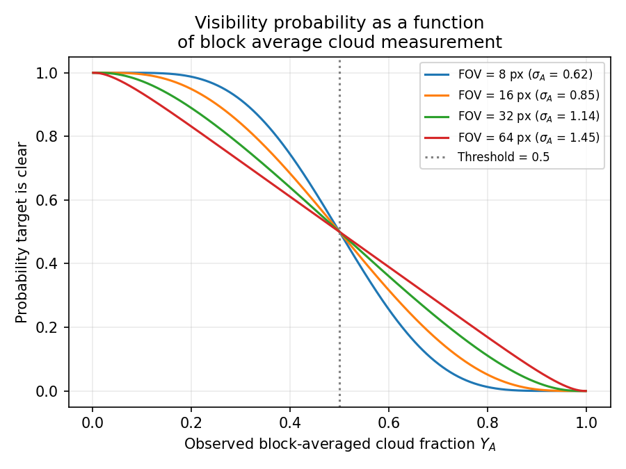

# Reproduction notes

Where the paper leaves a detail unspecified, this records what was chosen and why, so the
gap between the published numbers and this implementation is auditable.

Claims here cite evidence from individual training runs where one exists. Every run has a
write-up in [`docs/runs/`](runs/) generated by
[`scripts/run_report.py`](../scripts/run_report.py); see the [run index](runs/README.md).

## σ_A is ~6% larger than Figure 3

The paper states that σ_A is estimated by Monte Carlo from Equation (10),

```
σ²_A = k̃(0) − E_{U,V ~ Unif(A)}[ k̃(‖U − V‖) ],   k̃(r) = α² exp(−r/ℓ)
```

with the lookahead pixel side length derived from the sensor geometry:

> Using the lookahead resolution together with the ratio of the n-pixel footprint FOV to
> the 32-pixel-wide AoR, expressed as a fraction of the AoR's 250 km cross-track extent, we
> compute the side length L of a square lookahead pixel.

That reads as `L = (n/32) · 250 / 32 = n · 250/1024` km, which is what `clouds.lookahead_block_side_km`
implements. Evaluating Equation (10) at those side lengths gives:

| n | L (km) | σ_A here | σ_A in Figure 3 | ratio |
|---|---|---|---|---|
| 8 | 1.95 | 0.619 | 0.58 | 1.067 |
| 16 | 3.91 | 0.850 | 0.79 | 1.076 |
| 32 | 7.81 | 1.135 | 1.07 | 1.061 |
| 64 | 15.63 | 1.447 | 1.38 | 1.048 |



Solving for the side length that would reproduce each published value gives
`L = 1.70, 3.32, 6.73, 13.42` km — a near-constant **0.86×** our derivation across all four
FOVs. A uniform scale factor points at a small unstated geometric convention (a disc rather
than a square pixel, an effective rather than nominal cross-track extent, or a discretised
Monte-Carlo estimator that samples block *pixels* including coincident draws) rather than a
different model.

The functional form and the ordering across FOVs — the part that drives the
coverage-versus-fidelity trade-off in the results — are reproduced exactly. Since the
published values are what the paper's agents actually trained against, `--paper-sigma` (or
`VisibilityModel(..., use_paper_sigma=True)`) pins them. Both settings are exercised by the
test suite.

## Constraint cost normalisation

The paper writes the constraint as `J_c(π) ≤ μ P̄` with raw power units and reports a dual
step size of `η = 10⁻³` (Table 5). Taken literally, at `P̄ = 150` a fully active policy has
`Ĵ_c ≈ 75,000` against a threshold of 15,000, so a single dual step moves λ by ~60 — while
the reward is at most ~3 per epoch. The augmented reward would be swamped by the penalty
within one update.

This implementation therefore accumulates `c/P̄` instead of `c`. The constraint becomes
`Σ γ^t (c_t / P̄) ≤ μ`, dual steps land in the right order of magnitude for `η = 10⁻³`, and
the multiplier is comparable across the 15× span of budgets. It is also the same
normalisation the paper uses when *reporting* power (Table 1 gives Ē/P̄).

Set `PowerConfig(normalise_by_budget=False)` to accumulate raw units; `LagrangeState.budget`
then carries `P̄` so the threshold is `μ P̄` as written.

**Evidence.** In [cadet-plan n=32 P̄=150](runs/2026-08-28-cadet-plan-n32-P150.md), λ peaks at 0.136 and settles near 0.02 while episode reward is of
order 20 — large enough to steer behaviour, never large enough to swamp the reward. That is
the regime this normalisation was chosen to produce.

## Cloud field sub-cell resolution

The paper simulates cloud cover as a continuous GRF but rasterises the AoR at 32 columns
(7.8125 km per cell). Lookahead pixels are *finer* than an AoR cell for `n < 32`
(1.95 km at `n = 8`), so simulating the field only at AoR resolution would make the block
average equal to the pointwise value and collapse the very uncertainty Proposition 1 models.

The field is therefore sampled at `subpixels_per_cell = 4`, giving a 1.953 km sub-cell.
Lookahead pixels are then `n/8` sub-cells across — 1, 2, 4 and 8 for the four FOVs, all
integers. This is the coarsest resolution that puts every configuration on exact block
boundaries. Targets are placed at a uniformly random sub-cell within their AoR cell, since
`p_i` is a point on the surface rather than a whole cell.

## Target counts

The paper specifies 178 targets over the 364-row training world ("an expected 0.5 targets
per row" — 178/364 is actually 0.489) and 1,532 over the 3,064-row evaluation world
(exactly 0.5). `TARGET_DENSITY = 0.5` reproduces the evaluation figure exactly and the
training figure to within one target, and keeps density constant when episode length is
changed.

## Unspecified environment details

| Detail | Choice |
|---|---|
| Initial pointing state | Nadir (column 16); baselines start there too, for comparability |
| Roll at the AoR edge | Saturates rather than wrapping |
| Payload footprint at the edge | Clipped, so edge captures see fewer than 3 columns |
| Sensor-geometry channel | Payload encoded as 1.0, lookahead as 0.5, in one channel as the paper specifies |
| Visibility channel (ch. 5) | Belief for *all* live targets — Proposition 1 where measured, the prior elsewhere. This matches what the planner consumes; channels 2–4 already separate observed from unobserved |
| Lookahead pixel alignment | Blocks are aligned to the fixed world sub-grid rather than to the moving footprint. Physically the sensor's grid moves with the spacecraft, but the induced distribution of block averages is the same and the alignment lets the whole map be precomputed once per episode |
| Delegation cost | 18 units for the planner call *plus* 36 if the returned command is a slew, reading "an additional power cost" as additive |
| Episode end | `truncated=True` at the horizon (never `terminated`), the correct Gymnasium signal for a time limit |

## Baseline bounds

The paper plots the SSP and Oracle baselines but does not tabulate them. They can, however,
be recovered exactly: Table 2 gives both a target count and a gap-closure percentage for all
24 cells, and `gap = (v − ssp)/(oracle − ssp)` is then over-determined. Solving across the
full grid gives **SSP 209.5, Oracle 291.5**.

| | SSP | Oracle |
|---|---|---|
| paper, back-solved from Table 2 | 209.5 | 291.5 |
| this implementation | 211.2 | 290.2 |
| difference | **+0.8%** | **−0.5%** |

Scoring the paper's own target counts against *this implementation's* baselines reproduces
its published percentages to within about a point:

| cell | CADET (ours / paper) | CADET-Plan (ours / paper) |
|---|---|---|
| P̄=150, n=32 | 56.1 / 56.1 | 73.3 / 72.7 |
| P̄=150, n=64 | 64.3 / 64.1 | 75.1 / 74.4 |
| P̄=1500, n=64 | 83.5 / 82.5 | 83.9 / 82.9 |

**The baselines are reproduced.** Both are power-unconstrained offline plans that ignore
lookahead, so they depend on neither `n` nor `P̄` — a single pair covers the whole grid,
which is why the back-solve is so well determined.

*Correction.* An earlier version of this note claimed the SSP baseline was ~8% high against
a back-solved value of 194, and the run write-ups used that to argue roughly half the
shortfall from the paper was baseline calibration rather than policy quality. **That was
wrong.** The 194 came from back-solving the rounded averages in the abstract rather than the
per-cell grid. With correct baselines, the entire shortfall is policy performance:
[cadet n=32 P̄=150 at paper scale](runs/2026-08-29-cadet-n32-P150-paper.md) captures 225.8
targets where the paper reports 255.5 for the same cell — 11.6% fewer — and there is no
calibration effect to absorb any of it.

## The slack curriculum is load-bearing, and it overshoots

The paper specifies a budget-slack curriculum (hold `s = 5`, taper to 1) but does not
discuss its effect on the learning curve. In [cadet-plan n=32 P̄=150](runs/2026-08-28-cadet-plan-n32-P150.md) it dominates the entire run:

- With slack at 5 the constraint is nearly inert, and the policy learns the easy
  saturate-the-payload strategy — reward 23.2 at **4.95× the power budget**.
- As the threshold falls 500 → 100, reward collapses **80%** to 4.71. Captures must be
  given up faster than selectivity can be learned to replace them.
- After the taper completes the policy recovers to the *same* reward (23.3) at
  **0.90× budget** — a 5.5× improvement in power efficiency at equal performance.

That final comparison is the paper's thesis demonstrated within a single run: the gain comes
from imaging selectively, not from imaging more.

**The taper overshoots — but this is an artifact of the reduced profile, not of the
paper's method.** At 400k timesteps in [cadet-plan n=32 P̄=150](runs/2026-08-28-cadet-plan-n32-P150.md) the threshold is 297 while discounted cost has
fallen to 145, and Ē/P̄ is 1.52 against an allowance of 3.0: the policy cut spending to
roughly half of what the constraint permitted and lost reward for no benefit, with
`approx_kl` spiking to 0.342 (~30× a healthy value).

The cause is a scaling omission in `PROFILES`. Each profile scales `total_timesteps`,
`warmup_steps` and `taper_steps` together, so the curriculum keeps the same *proportions*
(3.3% warmup, 33% taper). But `lambda_lr` is a fixed `1e-3` and is **not** scaled, while the
threshold always travels the same 500 → 100:

| profile | dual updates during taper | threshold movement per dual update |
|---|---|---|
| `paper` (30M) | 9,766 | 0.041 |
| `quick` (2M) | 645 | **0.621** |

The `quick` threshold moves **15.2× faster per dual step** with an unchanged step size, so
the dual cannot track it and overcorrects. At the paper's scale the dual has 15× as many
updates to follow the same trajectory and would be expected to track it smoothly.

Two consequences. First, **gap-closure numbers from reduced profiles are pessimistic** —
roughly 300k of `quick`'s 2M timesteps are spent in an unnecessarily conservative regime
that a paper-scale run would not enter. Second, if reduced profiles are to be used for
anything quantitative, `lambda_lr` should scale with the taper compression rather than being
held fixed. This has not been tested.

## Delegation can absorb the whole maneuvering problem

In [cadet-plan n=32 P̄=150](runs/2026-08-28-cadet-plan-n32-P150.md) the trained CADET-Plan policy delegates on **every** epoch (`n_delegate` 3000/3000)
and never issues an explicit roll (`n_roll` 0). It converges there early — explicit rolls
are already ~0 by 118k timesteps, down from 156 at initialisation.

The controller therefore reduces to "exact SSP planner for maneuvering + learned policy for
sensing". This is a legitimate use of the `delegate` action rather than a defect, but it
means a CADET-Plan result says nothing about learned maneuvering quality.

**Delegation also appears to stabilise training.** [cadet n=32 P̄=150](runs/2026-08-28-cadet-n32-P150.md) — the same cell without the
`delegate` action — did not train at all: the policy saturated at 207k timesteps, gradients
went to exactly zero, and λ diverged to 46 against CADET-Plan's maximum of 0.136. The
plausible reading is that `delegate` gives the policy a competent maneuvering option
immediately, so it reaches a low-power regime before the dual punishes it into saturation,
whereas CADET spends its early training in a high-power regime learning to steer and λ
passes the point of no return first. If so, the paper's 42% vs 56% understates what
delegation contributes at tight budgets.

## The dual has no anti-windup, and it can diverge

λ is projected at zero from below but is **unbounded above**, and nothing guards the case
where the policy saturates and can no longer respond to it. In [cadet n=32 P̄=150](runs/2026-08-28-cadet-n32-P150.md) this proved fatal:
once the augmented penalty reached ~80× the reward magnitude, the action logits went one-hot,
entropy and policy gradient both hit exactly zero, and the frozen policy then integrated a
constant constraint violation into λ indefinitely (reaching 46 and still climbing linearly
when the run was killed).

The paper specifies no cap, entropy floor, or penalty bound. It also trains 15× longer per
taper step, so its dual moves far more gently — this failure may be specific to compressed
profiles rather than to the method. Untested. Candidate remedies, cheapest first: cap λ and
add an entropy floor; scale `lambda_lr` with the taper compression (argued for independently
above); or run at the `paper` profile.

Until one is tried, **this repo has no CADET-vs-CADET-Plan comparison.**

## Where the remaining shortfall comes from

[cadet n=32 P̄=150, paper scale](runs/2026-08-29-cadet-n32-P150-paper.md) captures 225.8 targets where the paper reports 255.5 for the same cell — 11.6% fewer,
which costs 38 points of gap closure because the SSP→Oracle window is only ~79 targets wide.
This records what has been eliminated as a cause and what has not.

### Verified identical to the paper

| | paper | here |
|---|---|---|
| SSP / Oracle baselines | 209.5 / 291.5 (back-solved) | 211.2 / 290.2 |
| Power costs (roll / lookahead / payload) | 36 / 200 / 750 | same |
| Payload footprint | 1×3, constrained to nadir row | same |
| Lookahead offset | 32 pixels ahead of nadir | same |
| Training episodes | 300 epochs | same |
| Evaluation episodes | 3,000 epochs, 1,532 targets | same |
| Evaluation action selection | deterministic | same |

The Oracle matching within 0.5% is the strongest single check: it exercises target
generation, geometry, agility limits and the DP planner end to end. **The environment is
reproduced; the shortfall is in the learned policy.**

### σ_A is eliminated

The 6% σ_A discrepancy documented above cannot explain any of it. σ_A enters Proposition 1
as a monotone scaling inside `Φ`, so it changes the *calibration* of the visibility
probabilities but never their *ordering*. Ranking simulated targets by predicted visibility
under σ_A = 1.135 and σ_A = 1.07 gives **identical orderings** (prediction correlation
0.99983) and therefore identical accuracy at every selection threshold:

| targets imaged | σ_A = 1.135 | σ_A = 1.07 |
|---|---|---|
| top 5% | 0.9888 | 0.9888 |
| top 10% | 0.9593 | 0.9593 |
| top 25% | 0.8394 | 0.8394 |

Since the agent's task is to *choose* which targets to image, a transformation that preserves
the ranking cannot change what it can achieve. `--paper-sigma` is therefore not worth a
retraining run to test this particular question.

### The binding constraint is coverage, not belief quality

That same table reframes the problem. Imaging the belief-ranked top 10% of targets would
yield **0.959** accuracy. The paper achieves 0.714 and this implementation 0.662 — both far
below what the beliefs support. Neither agent is limited by how well it estimates cloud
cover; both are limited by *getting the payload to the right place*, under agility limits and
a scrolling AoR, having only sensed part of the world.

### Deterministic evaluation is eliminated

Evaluating the trained policy stochastically rather than deterministically changes little and
in the wrong direction: Ē/P̄ 0.942 vs 0.926, and **fewer** targets (222.6 vs 226.1). Training
stochasticity is not propping up the power spend.

### The open lead: the policy under-spends its budget

Table 1 reports Ē/P̄ = **1.03** for CADET at this cell; this implementation evaluates at
**0.93**. That 10% of unspent budget is 45,180 units, or 60 additional payload captures —
about 40 targets at the observed accuracy, more than the 29.7-target deficit.

Roughly half of the difference is a measurement artifact rather than lost performance. The
episode-start transient (no cloud information yet, so heavy lookahead) amortises differently
across episode lengths:

| episode length | Ē/P̄ | targets per 1,000 epochs |
|---|---|---|
| 300 (training) | 0.979 | 75.8 |
| 1,000 | 0.946 | 76.4 |
| 3,000 (evaluation) | 0.926 | 75.4 |

Productivity is **flat** across all three, so the transient moves the reported power without
changing captures. But even at training length the policy reaches only 0.979 against the
paper's 1.03, so a genuine ~5% under-use remains.

Note also that the discounted constraint is slightly loose at training length: over 300
epochs `Σγ^t = (1 − 0.99³⁰⁰)/0.01 = 95.1`, not the `μ = 100` used as the threshold, so a
policy spending exactly P̄ every epoch registers 95.1 and could afford ~5% more. The agent is
therefore under-spending against a threshold that is already generous.

### λ is not the limiter, and coverage is not the problem

Both were tested and both are eliminated.

**Coverage selection works.** Comparing targets found in the payload footprint per payload
action isolates how well the agent chooses *when* to shoot:

| | targets per payload action |
|---|---|
| SSP (images blindly, every epoch) | 0.206 |
| this implementation | **1.041** |

5.1× better than blind imaging. And the imaging *volume* gap against the paper is only 4.6%
(341.5 targets imaged against 357.8); the accuracy gap is 7.4%. The agent is finding targets,
not missing them.

**λ is not suppressing spend.** Evaluating all twelve checkpoints of the paper-scale run and
pairing each with the λ actually applied around it gives a correlation of −0.963 — but that
is confounded, because λ rose while the taper was independently forcing spending down.
Restricting to the post-taper window (after 11M, slack fixed at 1) removes the confound: λ is
essentially flat there (0.0187–0.0257) while Ē/P̄ swings 0.867–0.995, and the correlation
falls to **−0.406**. λ varies too little to explain the variation in spend.

**The 300 vs 3,000 epoch horizon is not a difference from the paper.** The paper uses the
same split — 300-epoch training, 3,000-epoch evaluation with targets scaled to 1,532 — so it
cannot explain a divergence.

### Evaluation variance is larger than it looks

The checkpoint sweep initially appeared to show large differences between checkpoints (8% to
30% gap closed). Re-running the two extremes at n = 20 shows this was mostly noise:

| model | targets | s.e. | gap closed | 95% CI |
|---|---|---|---|---|
| 25M checkpoint | 232.1 | 2.7 | 26.5% | [19.7, 33.3] |
| 30M final | 227.7 | 2.3 | 20.9% | [15.2, 26.6] |

The intervals overlap; the apparent checkpoint advantage is not significant. Because the
SSP→Oracle window is only ~79 targets wide, per-episode variance of ~11 targets translates to
**±6 percentage points of gap closure at n = 20, and ±13 at n = 4.** Any gap-closure figure
from this repo should carry that interval, and single-digit differences between runs are not
meaningful. The gap to the paper's 56.1% is ~35 points — far outside it, so the shortfall is
real regardless.

### What remains

The environment is verified, σ_A is ruled out, coverage is good, λ is not binding, and the
horizon matches. What is left is a modest but systematic capability gap in the learned
policy — 4.6% fewer targets imaged and 7.4% lower conversion — that compounds into 35 points
of gap closure through a narrow baseline window.

The most informative next diagnostic is **not** another run at this cell. The paper's Table 3
reports capture accuracy across budgets: 0.892 at P̄ = 100, 0.714 at P̄ = 150, 0.202 at
P̄ = 1500. Those are qualitatively different regimes — at P̄ = 1500 the paper states power is
effectively unconstrained. Running P̄ = 1500 isolates FOV geometry from constraint handling:
matching the paper there but not at P̄ = 150 would localise the problem to the primal-dual
machinery, while falling short at both would point at the base policy or its encoder.

## What is not reproduced

Tables 1–4 and Figures 4–6 require all 24 configurations at 30M timesteps. Two cells have
been trained: [cadet-plan n=32 P̄=150](runs/2026-08-28-cadet-plan-n32-P150.md) at `quick`
scale (17.9% of the gap closed) and [cadet n=32 P̄=150, paper scale](runs/2026-08-29-cadet-n32-P150-paper.md) at full scale (18.5%). Both fall well short of
the paper's 42% and 56%, and neither is a reproduction — one cell of twenty-four, a single
seed, 20 evaluation episodes. `cadet.experiments` runs the grid, writes incrementally, and
regenerates Table 2/3-style summaries from it.
