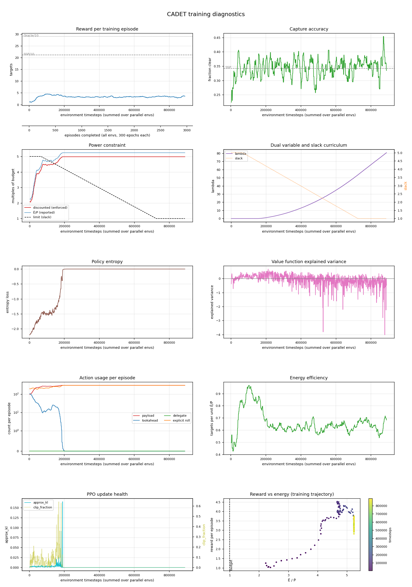

# cadet · n=32 · P̄=150

*Generated 2026-09-01 by `scripts/run_report.py`.*

> **Stopped early.** Reached 889,856 of 2,000,000 configured timesteps (44%). No evaluation was run, so there is no gap-closure number for this cell.

## Configuration

| | |
|---|---|
| Controller | `cadet` |
| Lookahead width | 32 |
| Power budget P̄ | 150.0 |
| Timesteps | 889,856 run of 2,000,000 configured |
| Parallel envs | 8 |
| Seed | 0 |
| Device | cuda |
| σ_A | 1.1351 |
| Cloud model | `field_scale=subpixel` (superseded) |
| Policy parameters | 2,156,967 |
| Curriculum | slack 5.0 held to 66,000, tapered over 660,000 |
| Wall clock | 0.49 h |

## Training dynamics

| moment | timesteps | reward | Ē/P̄ |
|---|---|---|---|
| Peak before the squeeze | 103,424 | 4.52 | 4.67 |
| Trough during the taper | 676,864 | 2.91 | 5.24 |
| Slack reaches 1 | 726,016 | 3.53 | 5.24 |
| Final | 889,856 | 3.58 | 5.24 |

Drop from peak to trough: **36%**.

| timesteps | reward | accuracy | slack | threshold | disc. cost | E/P | entropy |
|---|---|---|---|---|---|---|---|
| 1024 | — | — | 5.0 | 500 | — | — | — |
| 39936 | 2.48 | 0.361 | 5.0 | 500 | 380 | 4.03 | -1.81 |
| 79872 | 3.84 | 0.344 | 4.9 | 492 | 448 | 4.73 | -1.53 |
| 119808 | 4.40 | 0.310 | 4.7 | 467 | 448 | 4.74 | -1.46 |
| 159744 | 4.30 | 0.393 | 4.4 | 443 | 463 | 4.89 | -1.22 |
| 199680 | 3.61 | 0.370 | 4.2 | 419 | 498 | 5.24 | -0.00 |
| 239616 | 3.42 | 0.367 | 4.0 | 395 | 498 | 5.24 | -0.00 |
| 279552 | 3.46 | 0.376 | 3.7 | 371 | 498 | 5.24 | -0.00 |
| 319488 | 3.18 | 0.351 | 3.5 | 346 | 498 | 5.24 | -0.00 |
| 360448 | 3.12 | 0.398 | 3.2 | 322 | 498 | 5.24 | -0.00 |
| 400384 | 3.19 | 0.310 | 3.0 | 297 | 498 | 5.24 | -0.00 |
| 440320 | 3.21 | 0.300 | 2.7 | 273 | 498 | 5.24 | 0.00 |
| 480256 | 3.22 | 0.271 | 2.5 | 249 | 498 | 5.24 | 0.00 |
| 520192 | 3.12 | 0.349 | 2.2 | 225 | 498 | 5.24 | 0.00 |
| 560128 | 3.41 | 0.406 | 2.0 | 201 | 498 | 5.24 | 0.00 |
| 600064 | 3.34 | 0.368 | 1.8 | 176 | 498 | 5.24 | 0.00 |
| 640000 | 3.41 | 0.344 | 1.5 | 152 | 498 | 5.24 | 0.00 |
| 679936 | 3.06 | 0.361 | 1.3 | 128 | 498 | 5.24 | 0.00 |
| 719872 | 3.28 | 0.354 | 1.0 | 104 | 498 | 5.24 | 0.00 |
| 759808 | 3.53 | 0.354 | 1.0 | 100 | 498 | 5.24 | 0.00 |
| 799744 | 3.34 | 0.370 | 1.0 | 100 | 498 | 5.24 | 0.00 |
| 839680 | 3.18 | 0.366 | 1.0 | 100 | 498 | 5.24 | 0.00 |
| 879616 | 3.67 | 0.382 | 1.0 | 100 | 498 | 5.24 | 0.00 |

## Artifacts

Committed with this write-up:

- [Diagnostics figure](assets/2026-08-28-cadet-n32-P150.png)
- [Metric history — thinned from 869 rollouts](assets/2026-08-28-cadet-n32-P150-history.csv)

Not committed (regenerable, and `model.zip` is large): `runs/cadet_n32_P150_quick_FAILED/`.

---

<!-- ANALYSIS -->

## Analysis

_Written by hand; preserved when this report is regenerated._

**Negative result.** This run did not produce a controller. The policy saturated at
~207k timesteps and stopped learning entirely; everything after that is a frozen network
while the dual variable diverges. The run was killed at 890k once that was established.

### The policy stopped updating at 206,848 timesteps

| timestep | reward | λ | Ē/P̄ | entropy | approx_kl | lookahead | rolls |
|---|---|---|---|---|---|---|---|
| 50k | 3.23 | 0.000 | 4.11 | −1.69 | 0.0023 | 31 | 187 |
| 150k | 3.95 | 0.017 | 4.83 | −1.28 | 0.0042 | 21 | 258 |
| 200k | 3.61 | 1.11 | 5.24 | −0.004 | 0.00002 | **0** | 299 |
| 400k | 3.19 | 12.8 | 5.24 | 0.000 | 0.000 | 0 | 300 |
| 680k | 3.06 | **46.2** | 5.24 | 0.000 | 0.000 | 0 | 300 |

`approx_kl` is *exactly* zero from 206,848 onwards and `entropy_loss` from 408,576. A zero
KL between successive policies means the network is not changing at all — this is not slow
learning, it is a dead optimiser. Ē/P̄ is pinned at 5.24 and discounted cost at 498 for the
entire remainder of the run.

### Failure mechanism: saturation, then integral windup

1. The policy converged to the degenerate greedy strategy — payload every epoch, roll every
   epoch, **zero lookahead**. This is SSP-style saturation, and it costs 5.24× the budget.
2. λ began rising to penalise the violation.
3. As λ grew, the augmented reward `r̃ = r − λc` came to be dominated by the penalty. At
   λ = 46 the penalty term is ~240 against a reward of ~3, so advantages are ~80× larger
   than any reward signal.
4. Those advantages drove the action logits to a one-hot distribution. Entropy → 0, and with
   a saturated softmax the policy gradient → 0.
5. Frozen, the policy can no longer respond to λ at all. The dual therefore integrates a
   constant violation (498 against a threshold falling from 500 to 128) indefinitely, growing
   linearly and without bound.

The `ent_coef = 0.01` entropy bonus is nowhere near large enough to resist step 4 once the
penalty term is two orders of magnitude above the reward.

### What this says about `delegate`

The contrast with [cadet-plan at the same cell](2026-08-28-cadet-plan-n32-P150.md) is
sharper than a performance gap. There, λ never exceeded **0.136**; here it reached **46**.

`delegate` appears to act as a *stabiliser*, not just a performance boost. It hands the
policy an immediately competent maneuvering option, so CADET-Plan reached a low-power regime
before the dual could punish it into saturation. CADET must learn to steer from scratch,
spends its early training in a high-power regime while doing so, and λ passes the point of no
return before a good policy is found.

If that reading is right, the paper's 42% vs 56% understates what the delegate action
contributes at tight budgets: without it, this configuration does not train at all under
these hyperparameters.

### This is an implementation gap, not (necessarily) a paper result

The dual is projected at zero from below but is **unbounded above**, and there is no
safeguard for the case where the policy saturates and can no longer respond. Standard
practice in constrained RL is to cap λ, bound the augmented penalty, or use an entropy floor.
The paper does not specify one — but it also trains 15× longer per taper step, so its dual
moves far more gently (see *The slack curriculum* in the reproduction notes). The compressed
`quick` curriculum makes windup much more likely, so this failure may be specific to reduced
profiles.

**Do not read this as "CADET does not work".** Read it as "CADET does not train under this
implementation's dual dynamics at `quick` scale". Three things would test that, cheapest
first:

1. **Cap λ** (e.g. at 10) and add an entropy floor. Directly targets the mechanism.
2. **Scale `lambda_lr` with the taper compression**, as the reproduction notes already argue
   is needed independently.
3. **Run CADET at the `paper` profile**, where the dual has 15× as many updates to track the
   same threshold trajectory.

Until one of those is done, there is no CADET-vs-CADET-Plan comparison from this repo.
