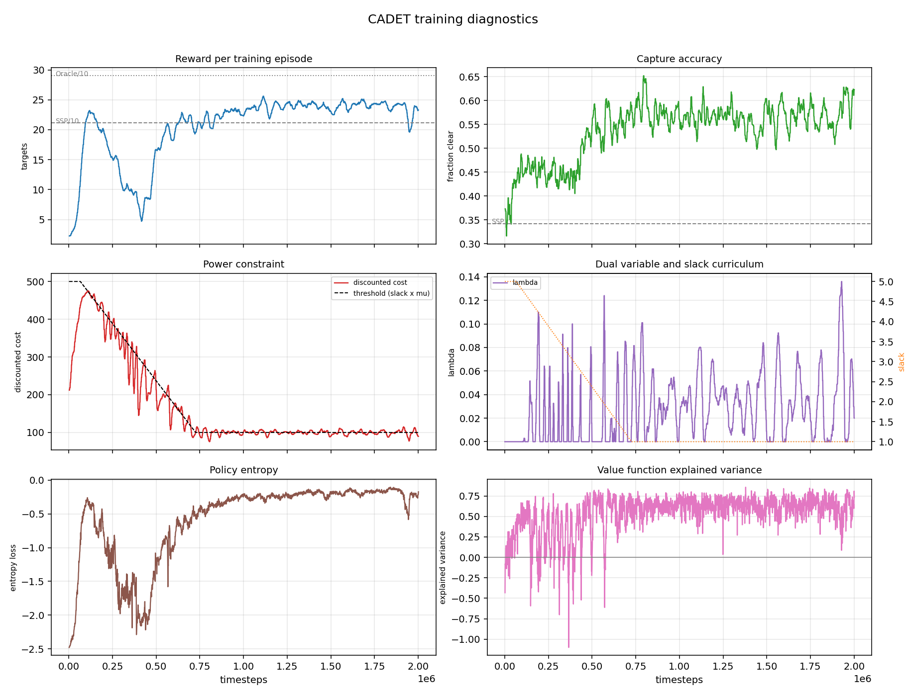

# cadet-plan · n=32 · P̄=150

*Generated 2026-08-28 by `scripts/run_report.py`.*

## Configuration

| | |
|---|---|
| Controller | `cadet-plan` |
| Lookahead width | 32 |
| Power budget P̄ | 150.0 |
| Timesteps | 2,000,000 |
| Parallel envs | 8 |
| Seed | 0 |
| Device | cuda |
| σ_A | 1.1351 |
| Policy parameters | 2,157,224 |
| Curriculum | slack 5.0 held to 66,000, tapered over 660,000 |
| Wall clock | 1.63 h |

## Result

| quantity | value | reference |
|---|---|---|
| Targets captured | **225.3** | SSP 211.2 · Oracle 290.1 |
| Gap closed | **17.9%** | paper: 56% avg (CADET-Plan) |
| Capture accuracy | 0.675 | SSP 0.342 |
| Normalised energy Ē/P̄ | 0.84 | within budget |
| Evaluation | 20 episodes × 3,000 epochs | |

Action usage per evaluation episode: payload 317, lookahead 145, delegate 3000, explicit rolls 0.

## Training dynamics

| moment | timesteps | reward | Ē/P̄ |
|---|---|---|---|
| Peak before the squeeze | 117,760 | 23.20 | 4.95 |
| Trough during the taper | 415,744 | 4.71 | 2.63 |
| Slack reaches 1 | 726,016 | 19.60 | 1.06 |
| Final | 2,000,896 | 23.30 | 0.90 |

Drop from peak to trough: **80%**.

| timesteps | reward | accuracy | slack | threshold | disc. cost | E/P | entropy |
|---|---|---|---|---|---|---|---|
| 1024 | — | — | 5.0 | 500 | — | — | — |
| 100352 | 21.70 | 0.472 | 4.8 | 479 | 469 | 4.98 | -0.33 |
| 199680 | 19.80 | 0.461 | 4.2 | 419 | 397 | 4.19 | -0.77 |
| 300032 | 11.10 | 0.431 | 3.6 | 358 | 328 | 3.43 | -1.75 |
| 400384 | 7.45 | 0.453 | 3.0 | 297 | 145 | 1.52 | -2.01 |
| 499712 | 16.60 | 0.548 | 2.4 | 237 | 213 | 2.17 | -1.20 |
| 600064 | 18.40 | 0.580 | 1.8 | 176 | 169 | 1.77 | -1.03 |
| 700416 | 22.30 | 0.580 | 1.2 | 116 | 107 | 1.08 | -0.60 |
| 799744 | 21.80 | 0.645 | 1.0 | 100 | 80 | 0.82 | -0.42 |
| 900096 | 23.10 | 0.568 | 1.0 | 100 | 97 | 1.00 | -0.30 |
| 1000448 | 22.30 | 0.561 | 1.0 | 100 | 101 | 1.02 | -0.24 |
| 1099776 | 24.40 | 0.514 | 1.0 | 100 | 108 | 1.12 | -0.27 |
| 1200128 | 24.20 | 0.571 | 1.0 | 100 | 95 | 0.97 | -0.25 |
| 1300480 | 24.20 | 0.612 | 1.0 | 100 | 100 | 1.03 | -0.21 |
| 1399808 | 24.60 | 0.561 | 1.0 | 100 | 99 | 1.02 | -0.23 |
| 1500160 | 23.00 | 0.590 | 1.0 | 100 | 91 | 0.91 | -0.19 |
| 1599488 | 22.90 | 0.579 | 1.0 | 100 | 95 | 0.95 | -0.15 |
| 1699840 | 24.10 | 0.589 | 1.0 | 100 | 93 | 0.95 | -0.18 |
| 1800192 | 24.60 | 0.536 | 1.0 | 100 | 107 | 1.07 | -0.16 |
| 1899520 | 24.20 | 0.549 | 1.0 | 100 | 101 | 1.03 | -0.16 |
| 1999872 | 23.30 | 0.623 | 1.0 | 100 | 90 | 0.90 | -0.21 |

## Artifacts

Committed with this write-up:

- [Diagnostics figure](assets/2026-08-28-cadet-plan-n32-P150.png)
- [Metric history](assets/2026-08-28-cadet-plan-n32-P150-history.csv) — 200 rows × 34 metrics, thinned from 1,954 rollouts (a full history is ~390 KB here and ~5.7 MB at 30M timesteps)
- [Evaluation result](assets/2026-08-28-cadet-plan-n32-P150-result.json)

Not committed (regenerable, and `model.zip` is large): `runs/cadet-plan_n32_P150/`.

---

<!-- ANALYSIS -->

## Analysis

_Written by hand; preserved when this report is regenerated._

### The run reaches the same reward on a fifth of the power

The single most useful number here is not the final reward but the pair of rows either end
of the training dynamics table:

| | reward | Ē/P̄ |
|---|---|---|
| Peak at 118k | 23.20 | **4.95** |
| Final at 2M | 23.30 | **0.90** |

The policy ends where it started in reward terms while spending **5.5× less power**. Early
on, with slack at 5, the constraint is nearly inert and the agent learns the easy strategy:
saturate the payload the way the SSP baseline does (102 capture attempts per episode,
accuracy 0.47). Everything after that is the curriculum forcing it to find the same
performance under a real budget — ending at 34 attempts per episode at accuracy 0.62.

That is the paper's thesis in one run: the gain does not come from imaging more, it comes
from imaging *selectively*.

### The 80% collapse is the curriculum working, not a failure

Reward falls from 23.20 to 4.71 between 118k and 416k. This is not instability — it tracks
the slack taper almost exactly. As the threshold falls 500 → 100, discounted cost is
dragged down with it and captures have to be given up faster than selectivity can be
learned to replace them. Once the taper completes at 726k the policy has recovered to 19.6
and keeps climbing.

Anyone sampling this run every 20 minutes (as the training was first narrated) sees 3.05 →
5.41 → 22.6 and reads a steady climb. That is an artifact of aliasing. The actual shape is
spike → collapse → recovery, and it is only visible in the full history — which is why
`progress.csv` is now always written (see [`plot_training.py`](../../scripts/plot_training.py)).

### The taper overshoots, and that costs reward

At 400k the threshold is 297 but discounted cost has fallen to 145, and Ē/P̄ is 1.52 against
an allowance of 3.0. The policy has cut spending to roughly **half** of what the constraint
actually permits at that moment, and reward (7.45) suffers for it. The dual variable
overcorrects during the taper and the policy follows it down further than required.

This is the clearest tuning lead in the run. A gentler taper, a smaller `lambda_lr`, or a
dual that is allowed to go negative-slack-aware would likely avoid burning ~300k timesteps
in an unnecessarily conservative regime. Worth testing before committing to a 24-cell sweep,
since every cell pays this cost.

### Learned maneuvering contributed nothing

`n_delegate` = 3000/3000 and `n_roll` = 0 at evaluation: the policy delegates roll planning
to the classical SSP solver on *every* epoch and never steers itself. It converged there
early — `n_roll` is already ~0.4 by 118k, down from 156 at initialisation.

So in this cell CADET-Plan reduces to "exact SSP planner for maneuvering + learned policy
for sensing". That is a legitimate use of the `delegate` action, but it means the result
says nothing about learned maneuvering quality, and it predicts a substantial CADET vs
CADET-Plan split. The paper reports 42% vs 56%; training CADET at this same cell is the
direct test and is the highest-value next run.

### λ stayed in a sane range, which validates the cost normalisation

λ peaks at 0.136 and settles near 0.02, non-zero in 70% of rollouts. That is the intended
regime: large enough to steer behaviour, never large enough to swamp a reward of order 20.
This is direct evidence for the normalisation decision recorded under *Constraint cost
normalisation* in the reproduction notes — with raw power units a single dual step would
have moved λ by ~60 and the augmented reward would have been dominated by the penalty
within one update.

### Caveats

- **2M timesteps is 6.7% of the paper's 30M.** The 17.9% gap closure should not be compared
  to the published 56% as though the two were like for like.
- **One seed, 20 evaluation episodes.** The paper's protocol uses more; run-to-run variance
  here is unmeasured.
- **Gap closure is highly sensitive to the SSP baseline.** Against this implementation's
  SSP (211.2) the policy closes 17.9%; against the paper's back-solved 194 it closes 31.0%.
  See *Baseline bounds* in the reproduction notes.
