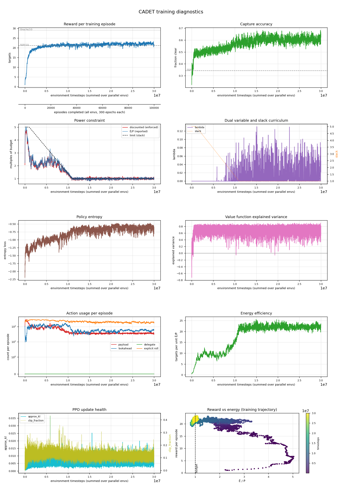

# cadet · n=32 · P̄=150

*Generated 2026-08-29 by `scripts/run_report.py`.*

## Configuration

| | |
|---|---|
| Controller | `cadet` |
| Lookahead width | 32 |
| Power budget P̄ | 150.0 |
| Timesteps | 30,000,128 run |
| Parallel envs | 8 |
| Seed | 0 |
| Device | cuda |
| σ_A | 1.1351 |
| Policy parameters | 2,156,967 |
| Curriculum | slack 5.0 held to 1,000,000, tapered over 10,000,000 |
| Wall clock | 16.59 h |

## Result

| quantity | value | reference |
|---|---|---|
| Targets captured | **225.8** | SSP 211.2 · Oracle 290.1 |
| Gap closed | **18.5%** | paper: 56% avg (CADET-Plan) |
| Capture accuracy | 0.661 | SSP 0.342 |
| Normalised energy Ē/P̄ | 0.93 | within budget |
| Evaluation | 20 episodes × 3,000 epochs | |

Action usage per evaluation episode: payload 328, lookahead 553, delegate 0, explicit rolls 1714.

## Training dynamics

| moment | timesteps | reward | Ē/P̄ |
|---|---|---|---|
| Peak before the squeeze | 9,790,464 | 23.14 | 1.52 |
| Trough during the taper | 10,346,496 | 19.09 | 1.19 |
| Slack reaches 1 | 11,000,832 | 21.78 | 1.04 |
| Final | 30,000,128 | 21.49 | 0.99 |

Drop from peak to trough: **18%**.

| timesteps | reward | accuracy | slack | threshold | disc. cost | E/P | entropy |
|---|---|---|---|---|---|---|---|
| 1024 | — | — | 5.0 | 500 | — | — | — |
| 1000448 | 16.43 | 0.494 | 5.0 | 500 | 284 | 2.89 | -1.41 |
| 1999872 | 19.33 | 0.503 | 4.6 | 460 | 209 | 2.15 | -1.18 |
| 3000320 | 19.91 | 0.498 | 4.2 | 420 | 179 | 1.80 | -1.03 |
| 3999744 | 20.15 | 0.506 | 3.8 | 380 | 236 | 2.35 | -1.03 |
| 5000192 | 20.29 | 0.512 | 3.4 | 340 | 227 | 2.32 | -0.96 |
| 5999616 | 20.93 | 0.517 | 3.0 | 300 | 215 | 2.27 | -1.01 |
| 7000064 | 21.15 | 0.497 | 2.6 | 260 | 232 | 2.45 | -0.87 |
| 7999488 | 21.14 | 0.505 | 2.2 | 220 | 185 | 1.89 | -1.00 |
| 8999936 | 21.40 | 0.565 | 1.8 | 180 | 157 | 1.60 | -0.86 |
| 10000384 | 21.34 | 0.558 | 1.4 | 140 | 129 | 1.33 | -0.78 |
| 10999808 | 21.78 | 0.604 | 1.0 | 100 | 102 | 1.04 | -0.75 |
| 12000256 | 21.96 | 0.596 | 1.0 | 100 | 104 | 1.01 | -0.76 |
| 12999680 | 20.83 | 0.628 | 1.0 | 100 | 92 | 0.94 | -0.67 |
| 14000128 | 21.99 | 0.561 | 1.0 | 100 | 107 | 1.07 | -0.71 |
| 14999552 | 20.28 | 0.597 | 1.0 | 100 | 99 | 0.94 | -0.67 |
| 16000000 | 21.97 | 0.567 | 1.0 | 100 | 102 | 1.02 | -0.69 |
| 17000448 | 21.33 | 0.633 | 1.0 | 100 | 94 | 0.95 | -0.77 |
| 17999872 | 20.33 | 0.626 | 1.0 | 100 | 94 | 0.94 | -0.68 |
| 19000320 | 22.22 | 0.605 | 1.0 | 100 | 106 | 1.06 | -0.70 |
| 19999744 | 21.53 | 0.607 | 1.0 | 100 | 99 | 0.99 | -0.62 |
| 21000192 | 22.34 | 0.599 | 1.0 | 100 | 103 | 1.00 | -0.57 |
| 21999616 | 22.00 | 0.611 | 1.0 | 100 | 92 | 0.90 | -0.65 |
| 23000064 | 22.11 | 0.614 | 1.0 | 100 | 97 | 0.95 | -0.56 |
| 23999488 | 21.60 | 0.552 | 1.0 | 100 | 104 | 1.06 | -0.56 |
| 24999936 | 22.37 | 0.581 | 1.0 | 100 | 99 | 0.99 | -0.56 |
| 26000384 | 21.75 | 0.615 | 1.0 | 100 | 94 | 0.95 | -0.60 |
| 26999808 | 21.49 | 0.624 | 1.0 | 100 | 91 | 0.95 | -0.67 |
| 28000256 | 21.07 | 0.621 | 1.0 | 100 | 94 | 0.96 | -0.58 |
| 28999680 | 22.47 | 0.602 | 1.0 | 100 | 102 | 1.00 | -0.56 |
| 30000128 | 21.49 | 0.629 | 1.0 | 100 | 105 | 0.99 | -0.68 |

## Artifacts

Committed with this write-up: see `assets/`. Metric history is 29,297 rollouts.

Not committed (regenerable, and `model.zip` is large): `runs/cadet_n32_P150/`.

---

<!-- ANALYSIS -->

## Analysis

_Written by hand; preserved when this report is regenerated._

### The headline: CADET trains fine at paper scale

[The same cell at the `quick` profile](2026-08-28-cadet-n32-P150.md) collapsed — policy
saturated at 207k timesteps, gradients exactly zero thereafter, λ diverging to 46. At the
paper profile the identical controller and hyperparameters trained cleanly for 30M
timesteps:

| | quick (failed) | **paper (this run)** |
|---|---|---|
| λ maximum | **46**, diverging | **~0.13**, bounded |
| approx_kl | 0.000 from 207k | 0.005–0.011 throughout |
| entropy | 0.000 (saturated) | −0.69 (healthy) |
| lookahead / episode | 0 | 553 |
| final Ē/P̄ | 5.24 | **0.93** ✓ |

This confirms the diagnosis recorded under *The slack curriculum* in the reproduction notes:
the collapse was an artifact of compressing the curriculum without scaling `lambda_lr`, not
a property of the method. The `paper` profile gives the policy 1.05M timesteps before the
constraint first bites (against `quick`'s 69k) and 9,766 dual updates to track the taper
(against 645). Both halves of the failure mechanism are removed by the profile alone.

**The dual anti-windup issue is real but not triggered here.** λ is still unbounded above;
this run simply never entered the regime where that matters.

### The result is well short of the paper

18.5% of the gap closed, against the paper's **42%** for CADET. Scored against the paper's
back-solved baselines instead of this implementation's, it is 31.5% — still short. The
constraint is satisfied (Ē/P̄ = 0.93), so this is not a case of buying reward with power.

Training is not the limitation: reward plateaued at ~21–22 from roughly 3M timesteps and the
remaining 27M added little. Whatever is missing is in the modelling or the evaluation, not
in the optimisation.

### Without a planner, the policy substitutes sensing

The behavioural contrast with CADET-Plan is sharper than the scores suggest:

| per evaluation episode | CADET (30M) | CADET-Plan (2M) |
|---|---|---|
| lookahead | **553** | 145 |
| payload | 328 | 317 |
| explicit rolls | **1714** | 0 |
| delegate | 0 | 3000 |
| capture accuracy | 0.661 | 0.675 |
| Ē/P̄ | 0.93 | 0.84 |

CADET fires the payload about as often and converts at nearly the same rate, but needs
**3.8× more lookahead measurements** and steers itself on 1714 epochs to get there — and
spends more total power doing it (0.93 vs 0.84). Denied an exact planner, it compensates by
buying far more information.

### What this does and does not establish about `delegate`

CADET at 30M (18.5%) and CADET-Plan at 2M (17.9%) land within 0.6 points of each other. It
is tempting to read that as "delegation does not help", and that reading would be wrong:
**the two runs differ in both controller and training scale**, so they are not an A/B.

The defensible statement is the reverse one. CADET-Plan reached the same score with **15×
less training** — 1.63 h against 16.59 h. At this cell, delegation appears to be worth
roughly an order of magnitude in sample efficiency. Whether it also raises the ceiling is
unknown, and requires CADET-Plan at the paper profile (~26 h) to answer.

**This repo still has no like-for-like CADET vs CADET-Plan comparison.**

### Caveats

- Single seed. One run cannot separate "CADET closes 18.5%" from "seed 0 closes 18.5%".
- 20 evaluation episodes, not the paper's protocol.
- Gap closure remains highly sensitive to the SSP baseline (18.5% vs 31.5% depending on
  which baselines are used); see *Baseline bounds* in the reproduction notes.
- The machine was briefly unplugged around 25M timesteps. The process survived on battery
  and `progress.csv` shows no discontinuity, but it is recorded here for completeness.
