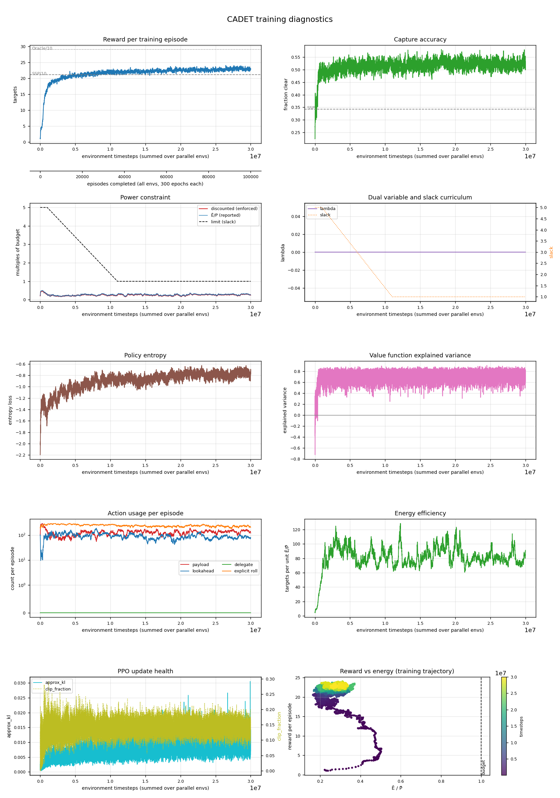

# cadet · n=32 · P̄=1500

*Generated 2026-08-30 by `scripts/run_report.py`.*

## Configuration

| | |
|---|---|
| Controller | `cadet` |
| Lookahead width | 32 |
| Power budget P̄ | 1500.0 |
| Timesteps | 30,000,128 run |
| Parallel envs | 8 |
| Seed | 0 |
| Device | cuda |
| σ_A | 1.1351 |
| Policy parameters | 2,156,967 |
| Curriculum | slack 5.0 held to 1,000,000, tapered over 10,000,000 |
| Wall clock | 15.38 h |

## Result

| quantity | value | reference |
|---|---|---|
| Targets captured | **237.7** | SSP 211.2 · Oracle 290.1 |
| Gap closed | **33.5%** | paper: 56% avg (CADET-Plan) |
| Capture accuracy | 0.536 | SSP 0.342 |
| Normalised energy Ē/P̄ | 0.24 | within budget |
| Evaluation | 20 episodes × 3,000 epochs | |

Action usage per evaluation episode: payload 1150, lookahead 799, delegate 0, explicit rolls 2089.

## Training dynamics

| moment | timesteps | reward | Ē/P̄ |
|---|---|---|---|
| Peak before the squeeze | 10,423,296 | 22.94 | 0.26 |
| Trough during the taper | 10,853,376 | 20.97 | 0.24 |
| Slack reaches 1 | 11,000,832 | 22.81 | 0.28 |
| Final | 30,000,128 | 22.91 | 0.25 |

Drop from peak to trough: **9%**.

| timesteps | reward | accuracy | slack | threshold | disc. cost | E/P | entropy |
|---|---|---|---|---|---|---|---|
| 1024 | — | — | 5.0 | 500 | — | — | — |
| 1000448 | 16.43 | 0.494 | 5.0 | 500 | 28 | 0.29 | -1.41 |
| 1999872 | 19.33 | 0.503 | 4.6 | 460 | 21 | 0.21 | -1.18 |
| 3000320 | 19.91 | 0.498 | 4.2 | 420 | 18 | 0.18 | -1.03 |
| 3999744 | 20.15 | 0.506 | 3.8 | 380 | 24 | 0.24 | -1.03 |
| 5000192 | 20.29 | 0.512 | 3.4 | 340 | 23 | 0.23 | -0.96 |
| 5999616 | 20.93 | 0.505 | 3.0 | 300 | 28 | 0.30 | -1.04 |
| 7000064 | 21.31 | 0.503 | 2.6 | 260 | 25 | 0.26 | -0.95 |
| 7999488 | 21.52 | 0.506 | 2.2 | 220 | 19 | 0.20 | -0.80 |
| 8999936 | 21.66 | 0.539 | 1.8 | 180 | 29 | 0.31 | -0.88 |
| 10000384 | 21.71 | 0.494 | 1.4 | 140 | 23 | 0.25 | -0.92 |
| 10999808 | 22.81 | 0.537 | 1.0 | 100 | 26 | 0.28 | -0.90 |
| 12000256 | 22.34 | 0.520 | 1.0 | 100 | 21 | 0.22 | -0.93 |
| 12999680 | 22.54 | 0.522 | 1.0 | 100 | 29 | 0.31 | -0.78 |
| 14000128 | 21.81 | 0.526 | 1.0 | 100 | 28 | 0.29 | -0.99 |
| 14999552 | 22.18 | 0.543 | 1.0 | 100 | 28 | 0.30 | -0.90 |
| 16000000 | 22.74 | 0.530 | 1.0 | 100 | 22 | 0.24 | -0.87 |
| 17000448 | 22.73 | 0.536 | 1.0 | 100 | 22 | 0.23 | -0.86 |
| 17999872 | 21.71 | 0.548 | 1.0 | 100 | 21 | 0.22 | -0.85 |
| 19000320 | 22.07 | 0.553 | 1.0 | 100 | 19 | 0.20 | -0.78 |
| 19999744 | 22.58 | 0.534 | 1.0 | 100 | 21 | 0.23 | -0.79 |
| 21000192 | 22.45 | 0.526 | 1.0 | 100 | 25 | 0.26 | -0.77 |
| 21999616 | 22.97 | 0.516 | 1.0 | 100 | 31 | 0.32 | -0.72 |
| 23000064 | 22.81 | 0.516 | 1.0 | 100 | 28 | 0.29 | -0.70 |
| 23999488 | 21.89 | 0.495 | 1.0 | 100 | 28 | 0.29 | -0.84 |
| 24999936 | 23.47 | 0.520 | 1.0 | 100 | 27 | 0.28 | -0.78 |
| 26000384 | 22.62 | 0.539 | 1.0 | 100 | 27 | 0.28 | -0.80 |
| 26999808 | 22.78 | 0.529 | 1.0 | 100 | 25 | 0.28 | -0.87 |
| 28000256 | 22.93 | 0.519 | 1.0 | 100 | 25 | 0.27 | -0.80 |
| 28999680 | 23.13 | 0.535 | 1.0 | 100 | 31 | 0.32 | -0.70 |
| 30000128 | 22.91 | 0.523 | 1.0 | 100 | 25 | 0.25 | -0.72 |

## Artifacts

Committed with this write-up: see `assets/`. Metric history is 29,297 rollouts.

Not committed (regenerable, and `model.zip` is large): `runs/cadet_n32_P1500/`.

---

<!-- ANALYSIS -->

## Analysis

_Written by hand; preserved when this report is regenerated._

> **Superseded in part, 2026-09-01.** The 33.5% below is measured under this repo's cloud
> model. Under the author's — field sampled at lookahead-pixel scale, ground truth equal to
> the observed cloud-free test — these same weights score **264.1 ± 2.9 targets, 65.2% of
> the gap**, against the paper's 60.1%. The trajectory-coverage measurements below stand;
> the shortfall they were explaining does not. See
> [`shortfall-resolved.md`](../shortfall-resolved.md).

This run was a **diagnostic**, not a reproduction attempt. At P̄ = 1500 the maximum spend in
any single epoch is 786 units — 0.52× the budget — so the power constraint *cannot* bind. λ
stayed at exactly 0 for all 30M timesteps. That removes the primal–dual machinery entirely
and isolates the base policy.

### Result

| | this run | paper (Table 2) |
|---|---|---|
| Targets captured | 237.7 | 258.8 |
| Gap closed | **33.5%** | 60.1% |
| Capture accuracy | 0.536 | 0.202 (see below) |
| Ē/P̄ | 0.244 | — (unconstrained regime not tabulated) |

Note the shortfall is *relatively smaller* here than at the constrained budget: 91.8% of the
paper's target count against 88.4% at P̄ = 150. Whatever is missing is not primarily the
constraint handling.

### Correction: coverage is NOT the defect

An earlier version of this analysis concluded the learned trajectory was 25% short of the DP
optimum and that this was the root cause. **Directly testing it refuted the conclusion.**
Pairing the learned sensing policy with the SSP DP's trajectory raises coverage from 455 to
607 targets but *drops* captures from 237.7 to 207.5 — worse than the SSP baseline. Forcing
better coverage hurts, because the DP ignores clouds while the learned policy steers toward
believed-clear targets. See the reproduction notes for the full table of refuted hypotheses.

The measurement below is retained because the numbers are correct; only the interpretation
was wrong.

### Trajectory coverage measurements

Measuring targets that pass under the payload footprint — independent of when the agent
chooses to shoot — isolates steering quality:

| trajectory | targets covered per 3000 epochs | conversion |
|---|---|---|
| SSP optimal DP | 607.0 | 0.348 |
| **learned policy (30M)** | **455.3** (0.75× SSP) | **0.522** |
| Oracle DP | 373.7 | 0.776 |

The learned policy covers only **75%** of the ground the target-maximising DP achieves, up
from 0.72 at 15M — improving, but slowly, and 30M timesteps was not enough to close it.

The Oracle row shows raw coverage is not the objective: it deliberately covers *less* than
SSP (373.7 vs 607.0) while capturing far more, because it steers toward *clear* targets. The
learned policy sits between the two on both axes — genuinely using cloud information
(conversion 0.522 against blind 0.348) but neither covering like the DP nor converting like
the Oracle.

**This is the mechanistic explanation for the paper's CADET < CADET-Plan ordering.** The
`delegate` action hands the policy the DP trajectory for free, so CADET-Plan starts at
607-equivalent coverage while CADET must learn it and reaches 75% after 30M timesteps.

### An earlier metric of mine was misleading

At the 5M checkpoint I reported "steering is excellent — 0.430 encounters per shot against
SSP's 0.206". That statistic conflates *selectivity* with *steering*: it is high when the
agent shoots only on epochs where targets are present, regardless of whether its trajectory
is good. The saturation test exposed it — between 5M and 15M the payload duty cycle rose from
33% to 51% (55% more shots) while total encounters moved only 424 → 433 (+2%). The
trajectory, not the shot timing, was the binding limit. Trajectory coverage is the correct
metric and was only measurable by instrumenting the path directly.

### The idle fraction remains unexplained

At evaluation the policy does nothing on **35%** of epochs (1,051 of 3,000), despite both
alternatives being free in this regime — it uses Ē/P̄ = 0.244 of an available 0.52. Shooting
on those epochs has positive expected value and looking ahead has option value; idling is
strictly dominated. This did not resolve over 30M timesteps and is the clearest remaining
defect. The entropy setup (`ent_coef = 0.01` with deterministic argmax at evaluation) is the
prime suspect and is untested.

### Retracted: the P̄ = 1500 accuracy figure reconciles fine

This section previously argued that Table 3's 0.202 was 2.1× a provable upper bound and
should not be used as a comparison target. **That was wrong** — correct arithmetic on the
wrong denominator.

The paper's *Metrics* section defines capture accuracy as the fraction of payload
*captures* that image a cloud-free target, and the author confirmed it: with surplus power
the agent fires on epochs where its footprint is empty. This run took 1,150 payload actions
and captured 237.7 cloud-free targets, so its accuracy under the paper's definition is
**0.207** against the published **0.202**.

The 0.536 in the result table above is clear-captures ÷ targets-imaged, which is not the
paper's metric. See [`shortfall-resolved.md`](../shortfall-resolved.md) §1.
