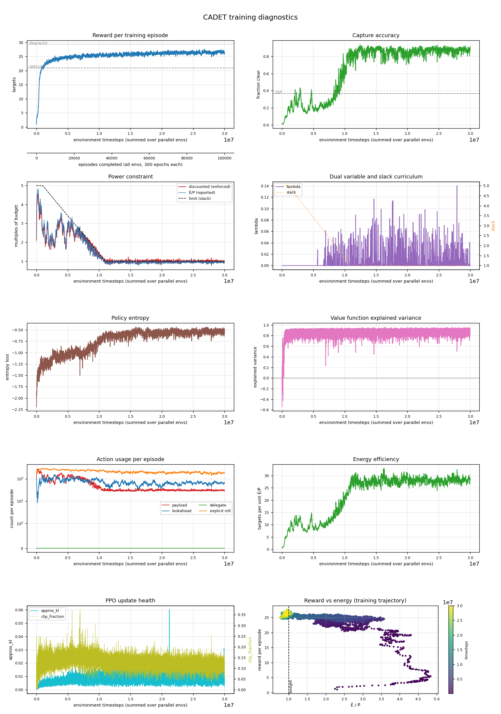

# cadet · n=32 · P̄=150

*Generated 2026-09-02 by `scripts/run_report.py`.*

## Configuration

| | |
|---|---|
| Controller | `cadet` |
| Lookahead width | 32 |
| Power budget P̄ | 150.0 |
| Timesteps | 30,000,128 run |
| Parallel envs | 8 |
| Seed | 0 |
| Device | auto |
| σ_A | 1.1351 |
| Cloud model | `field_scale=lookahead` |
| Policy parameters | 2,156,967 |
| Curriculum | slack 5.0 held to 1,000,000, tapered over 10,000,000 |
| Wall clock | 15.85 h |

## Result

| quantity | value | reference |
|---|---|---|
| Targets captured | **278.2** | SSP 209.3 · Oracle 293.3 |
| Gap closed | **82.0%** | paper: 56% avg (CADET-Plan) |
| Capture accuracy | 0.990 | SSP 0.366 |
| Normalised energy Ē/P̄ | 0.86 | within budget |
| Evaluation | 20 episodes × 3,000 epochs | |

Action usage per evaluation episode: payload 281, lookahead 574, delegate 0, explicit rolls 1696.

## Training dynamics

| moment | timesteps | reward | Ē/P̄ |
|---|---|---|---|
| Peak before the squeeze | 10,555,392 | 26.42 | 1.16 |
| Trough during the taper | 10,747,904 | 24.78 | 0.98 |
| Slack reaches 1 | 11,000,832 | 25.18 | 0.95 |
| Final | 30,000,128 | 26.07 | 0.90 |

Drop from peak to trough: **6%**.

| timesteps | reward | accuracy | slack | threshold | disc. cost | E/P | entropy |
|---|---|---|---|---|---|---|---|
| 1024 | — | — | 5.0 | 500 | — | — | — |
| 1000448 | 21.38 | 0.195 | 5.0 | 500 | 267 | 2.70 | -1.32 |
| 1999872 | 22.91 | 0.321 | 4.6 | 460 | 177 | 1.85 | -1.31 |
| 3000320 | 23.45 | 0.329 | 4.2 | 420 | 198 | 2.09 | -1.09 |
| 3999744 | 24.71 | 0.147 | 3.8 | 380 | 329 | 3.40 | -0.99 |
| 5000192 | 25.16 | 0.196 | 3.4 | 340 | 274 | 2.80 | -1.03 |
| 5999616 | 25.08 | 0.211 | 3.0 | 300 | 241 | 2.55 | -0.95 |
| 7000064 | 23.74 | 0.239 | 2.6 | 260 | 230 | 2.31 | -1.05 |
| 7999488 | 25.15 | 0.284 | 2.2 | 220 | 203 | 2.02 | -0.94 |
| 8999936 | 25.80 | 0.518 | 1.8 | 180 | 150 | 1.46 | -0.93 |
| 10000384 | 25.33 | 0.585 | 1.4 | 140 | 138 | 1.33 | -0.77 |
| 10999808 | 25.18 | 0.768 | 1.0 | 100 | 101 | 0.95 | -0.58 |
| 12000256 | 25.48 | 0.850 | 1.0 | 100 | 91 | 0.88 | -0.56 |
| 12999680 | 24.93 | 0.833 | 1.0 | 100 | 99 | 1.00 | -0.63 |
| 14000128 | 25.27 | 0.870 | 1.0 | 100 | 98 | 0.96 | -0.61 |
| 14999552 | 25.87 | 0.870 | 1.0 | 100 | 98 | 0.93 | -0.55 |
| 16000000 | 25.34 | 0.849 | 1.0 | 100 | 94 | 0.87 | -0.53 |
| 17000448 | 25.99 | 0.851 | 1.0 | 100 | 98 | 0.95 | -0.61 |
| 17999872 | 25.83 | 0.807 | 1.0 | 100 | 98 | 0.93 | -0.54 |
| 19000320 | 26.15 | 0.863 | 1.0 | 100 | 98 | 0.95 | -0.64 |
| 19999744 | 26.31 | 0.872 | 1.0 | 100 | 88 | 0.86 | -0.56 |
| 21000192 | 27.04 | 0.871 | 1.0 | 100 | 99 | 0.95 | -0.53 |
| 21999616 | 26.65 | 0.881 | 1.0 | 100 | 96 | 0.93 | -0.51 |
| 23000064 | 26.74 | 0.777 | 1.0 | 100 | 105 | 1.00 | -0.57 |
| 23999488 | 26.35 | 0.914 | 1.0 | 100 | 95 | 0.94 | -0.57 |
| 24999936 | 26.77 | 0.853 | 1.0 | 100 | 98 | 0.97 | -0.53 |
| 26000384 | 26.70 | 0.855 | 1.0 | 100 | 99 | 0.96 | -0.56 |
| 26999808 | 26.50 | 0.878 | 1.0 | 100 | 100 | 0.96 | -0.51 |
| 28000256 | 25.96 | 0.831 | 1.0 | 100 | 104 | 0.94 | -0.60 |
| 28999680 | 26.55 | 0.874 | 1.0 | 100 | 101 | 0.97 | -0.50 |
| 30000128 | 26.07 | 0.915 | 1.0 | 100 | 92 | 0.90 | -0.52 |

## Artifacts

Committed with this write-up:

- [Diagnostics figure](assets/2026-09-02-cadet-n32-P150-lookahead.png)
- [Metric history — thinned from 29,297 rollouts](assets/2026-09-02-cadet-n32-P150-lookahead-history.csv)
- [Evaluation result](assets/2026-09-02-cadet-n32-P150-lookahead-result.json)

Not committed (regenerable, and `model.zip` is large): `runs/lookahead/cadet_n32_P150/`.

---

<!-- ANALYSIS -->

## Analysis

_Written by hand; preserved when this report is regenerated._

**The first run trained against the paper's own conventions.** Everything before this used a
sub-pixel cloud field with pointwise ground truth; this uses the lookahead-scale field the
author described, where observing a pixel settles whether a target in it is cloud free.

### Result

| | this run | paper (Table 2/3, n=32, P̄=150) |
|---|---|---|
| Targets captured | **278.2 ± 2.9** | 255.5 |
| Gap closed | **82.0%** | 56.1% |
| Capture accuracy | **0.990** | 0.714 |
| Ē/P̄ | **0.86** | 1.03 (Table 1) |
| Payload actions per episode | 281 | ~358 (implied by 255.5 / 0.714) |

The paper's own CADET-Plan at this cell reaches 72.7%. This is plain CADET, without the
delegate action, at 82.0% — and 94.9% of the Oracle's 293.3.

### What retraining actually bought

Against the transferred policy — same cell, same seed, same hyperparameters, trained on the
old cloud model and evaluated here — the gain is +10.6 targets, and it decomposes cleanly:

| 20 episodes | captured | payload shots | believed-clear opportunities | missed | shots at believed-obscured |
|---|---|---|---|---|---|
| **retrained (this run)** | **278.2** | 281 | **269.6** | 0.0 | **10.1** |
| transferred | 267.6 | 320 | 258.5 | 0.3 | 60.4 |

Two separate improvements. It **steers better** — 11 more believed-clear opportunities per
episode — and it **wastes far less** — 10 shots at targets it believes are obscured, against
60. Neither policy misses opportunities it has: both convert essentially every certain
capture available. That confirms the earlier finding that under this convention shot *timing*
is close to trivial and steering is the whole problem, and it shows training under the
correct reward buys real steering quality rather than just better scoring.

The 50 avoided shots are also why energy falls: 50 × 750 units over 3,000 epochs is 12.5 per
epoch, about 8% of the budget.

### The constraint binds, then stands down

λ is flat zero to ~5.5M, then active in the 0–0.14 band from 7M onward — genuinely
regulating, with no windup. Ē/P̄ tracks the slack curriculum down from 5×, meets the budget
at ~11M, and settles at **0.86**. The final discounted cost is 92.8 against a threshold of
100, so λ relaxes back to 0: at convergence *the constraint is no longer binding*.

This is a real qualitative difference from the paper, which reports 1.03 and describes both
controllers as operating "close to the imposed budget". This policy finishes under budget
because it has nothing to spend the remainder on — at ~270 believed-clear opportunities per
episode and 0.99 accuracy, extra power buys shots at targets it knows are obscured. It is
the correct behaviour for the objective, and it is not what the paper reports.

Contrast with the P̄=1500 diagnostic, where λ ≡ 0 for all 30M steps because the constraint
*could not* bind. This cell exercises the primal–dual machinery properly, which is why it was
chosen for the single retrain.

### Cloud-aware targeting arrives as a phase transition

Capture accuracy sits at 0.20–0.33 — at or below the SSP base rate — until ~9M timesteps,
then rises sharply to 0.85–0.90 and holds for the remaining 21M. Energy efficiency shows the
same break at the same place, 10 → 27 targets per unit Ē/P̄. The policy does not improve
smoothly into cloud-awareness; it finds it. The old-model run never made this transition,
plateauing near 0.5.

### Converged by ~12M

The 20M checkpoint evaluates at 278.7 (82.6%) and the final 30M at 278.2 (82.0%) — identical
within a 2.9-target standard error. The last 18M timesteps bought nothing measurable. If the
remaining 23 cells are ever run, 12–15M looks sufficient, which would roughly halve the
~21-day grid estimate.

### The overshoot is now the open question

Closing 82.0% against a published 56.1% is a larger discrepancy than the 8% shortfall this
whole investigation began with, pointing the other way. It is not a scoring artifact: the
baselines are shared, the conventions are the author's, and the policy is measurably better
at the task.

The sharpest clue is accuracy — **0.990 here against 0.714 published**. Under a convention
where a lookahead observation is decisive, a well-trained agent should be near-perfect on
targets it has observed, so a 29% miss rate implies the paper's agent faced residual
uncertainty this run does not.

> **A first explanation offered here was wrong and is withdrawn.** It proposed that our agent
> might see a richer observation — a belief raster carrying the Proposition 1 probability that
> the paper's agent may have lacked. The paper specifies `C = 8` channels including *"the
> probability of point visibility given block visibility according to Proposition (1)"*, plus
> the cloud value and mask channels: our tensor exactly. The observation spaces match and
> cannot explain the difference.

The working explanation is now that the Prop-1 noise was removed only from the *metric*, not
from the training reward — which would leave this run's environment easier than the paper's.
That is written up with a pre-registered prediction in
[`truth-noise-hypothesis.md`](../truth-noise-hypothesis.md) and is the subject of the next
training run.

### What this does confirm

Every qualitative claim the paper makes about this cell reproduces: the constrained policy
satisfies its power budget, cloud-aware target selection emerges from the reward rather than
being hand-coded, the primal–dual multiplier regulates without tuning a penalty, and CADET
closes a clear majority of the SSP→Oracle gap. The disagreement is one of degree, and in the
direction of the method working *better* than reported.
