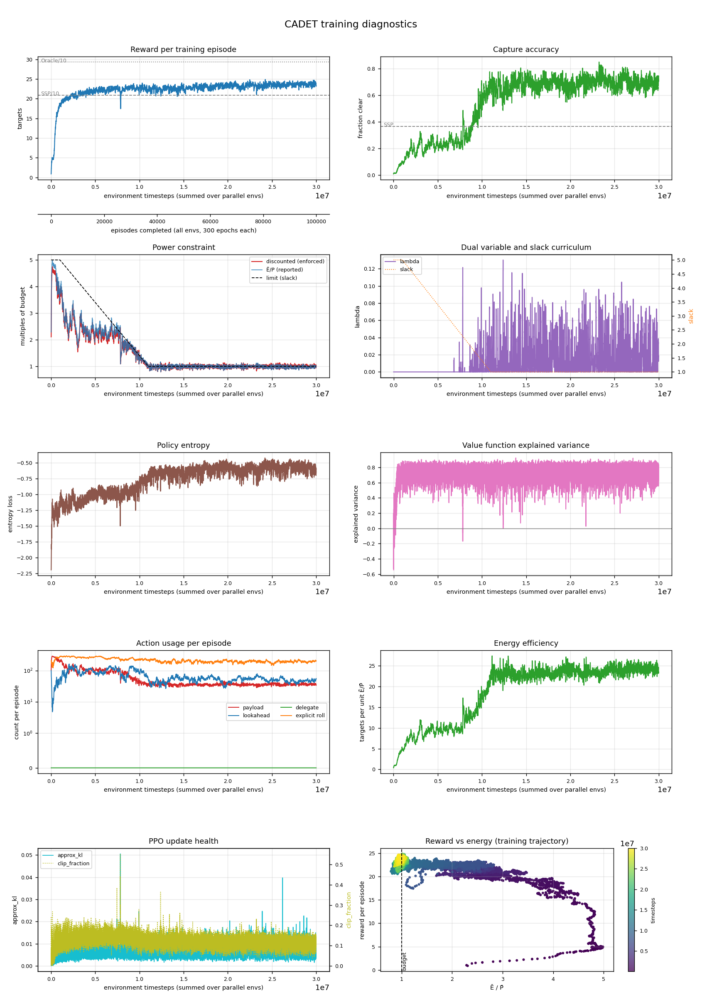

# cadet · n=32 · P̄=150

*Generated 2026-09-03 by `scripts/run_report.py`.*

## Configuration

| | |
|---|---|
| Controller | `cadet` |
| Lookahead width | 32 |
| Power budget P̄ | 150.0 |
| Timesteps | 30,000,128 run |
| Parallel envs | 8 |
| Seed | 0 |
| Device | auto |
| σ_A | 1.1351 |
| Cloud model | `field_scale=lookahead`, `truth_noise=True` |
| Policy parameters | 2,156,967 |
| Curriculum | slack 5.0 held to 1,000,000, tapered over 10,000,000 |
| Wall clock | 18.80 h |

## Result

| quantity | value | reference |
|---|---|---|
| Targets captured | **268.5** | SSP 209.3 · Oracle 293.3 |
| Gap closed | **70.5%** | paper: 56% avg (CADET-Plan) |
| Capture accuracy | 0.793 | SSP 0.366 |
| Normalised energy Ē/P̄ | 0.97 | within budget |
| Evaluation | 20 episodes × 3,000 epochs | |

Action usage per evaluation episode: payload 339, lookahead 534, delegate 0, explicit rolls 2110.

## Training dynamics

| moment | timesteps | reward | Ē/P̄ |
|---|---|---|---|
| Peak before the squeeze | 10,313,728 | 23.99 | 1.26 |
| Trough during the taper | 10,882,048 | 21.34 | 0.97 |
| Slack reaches 1 | 11,000,832 | 22.16 | 0.97 |
| Final | 30,000,128 | 23.40 | 0.99 |

Drop from peak to trough: **11%**.

| timesteps | reward | accuracy | slack | threshold | disc. cost | E/P | entropy |
|---|---|---|---|---|---|---|---|
| 1024 | — | — | 5.0 | 500 | — | — | — |
| 1000448 | 18.24 | 0.102 | 5.0 | 500 | 352 | 3.72 | -1.14 |
| 1999872 | 20.11 | 0.260 | 4.6 | 460 | 215 | 2.25 | -1.09 |
| 3000320 | 20.34 | 0.314 | 4.2 | 420 | 163 | 1.74 | -1.12 |
| 3999744 | 22.10 | 0.249 | 3.8 | 380 | 220 | 2.28 | -1.13 |
| 5000192 | 21.39 | 0.237 | 3.4 | 340 | 218 | 2.26 | -1.03 |
| 5999616 | 22.36 | 0.245 | 3.0 | 300 | 205 | 2.20 | -1.16 |
| 7000064 | 22.66 | 0.253 | 2.6 | 260 | 209 | 2.27 | -0.97 |
| 7999488 | 21.49 | 0.298 | 2.2 | 220 | 172 | 1.81 | -1.10 |
| 8999936 | 22.97 | 0.383 | 1.8 | 180 | 172 | 1.77 | -0.97 |
| 10000384 | 22.80 | 0.585 | 1.4 | 140 | 128 | 1.25 | -0.82 |
| 10999808 | 22.16 | 0.716 | 1.0 | 100 | 95 | 0.97 | -0.66 |
| 12000256 | 22.89 | 0.664 | 1.0 | 100 | 101 | 1.02 | -0.70 |
| 12999680 | 22.77 | 0.651 | 1.0 | 100 | 86 | 0.86 | -0.58 |
| 14000128 | 23.27 | 0.721 | 1.0 | 100 | 97 | 1.01 | -0.61 |
| 14999552 | 23.51 | 0.675 | 1.0 | 100 | 104 | 1.05 | -0.64 |
| 16000000 | 22.78 | 0.610 | 1.0 | 100 | 103 | 1.05 | -0.72 |
| 17000448 | 23.35 | 0.682 | 1.0 | 100 | 106 | 1.08 | -0.68 |
| 17999872 | 23.34 | 0.672 | 1.0 | 100 | 105 | 1.06 | -0.66 |
| 19000320 | 23.64 | 0.689 | 1.0 | 100 | 104 | 1.01 | -0.68 |
| 19999744 | 23.21 | 0.657 | 1.0 | 100 | 94 | 0.95 | -0.57 |
| 21000192 | 23.58 | 0.733 | 1.0 | 100 | 92 | 0.94 | -0.74 |
| 21999616 | 23.39 | 0.717 | 1.0 | 100 | 102 | 1.01 | -0.60 |
| 23000064 | 23.10 | 0.698 | 1.0 | 100 | 101 | 1.00 | -0.58 |
| 23999488 | 22.14 | 0.770 | 1.0 | 100 | 93 | 0.94 | -0.59 |
| 24999936 | 23.46 | 0.693 | 1.0 | 100 | 95 | 0.95 | -0.64 |
| 26000384 | 23.41 | 0.731 | 1.0 | 100 | 106 | 1.05 | -0.61 |
| 26999808 | 24.57 | 0.614 | 1.0 | 100 | 100 | 1.01 | -0.47 |
| 28000256 | 23.54 | 0.664 | 1.0 | 100 | 104 | 1.01 | -0.58 |
| 28999680 | 23.05 | 0.739 | 1.0 | 100 | 99 | 0.93 | -0.58 |
| 30000128 | 23.40 | 0.722 | 1.0 | 100 | 101 | 0.99 | -0.61 |

## Artifacts

Committed with this write-up:

- [Diagnostics figure](assets/2026-09-03-cadet-n32-P150-truthnoise.png)
- [Metric history — thinned from 29,297 rollouts](assets/2026-09-03-cadet-n32-P150-truthnoise-history.csv)
- [Evaluation result](assets/2026-09-03-cadet-n32-P150-truthnoise-result.json)

Not committed (regenerable, and `model.zip` is large): `runs/truthnoise/cadet_n32_P150/`.

---

<!-- ANALYSIS -->

## Analysis

_Written by hand; preserved when this report is regenerated._

**The first run trained against the environment the paper actually used.** The author
confirmed in [message 4](../author-correspondence.md) that the Prop-1 noise was present
during training — payload success decided by `Y(p) = sigmoid(z̃_A + ε) < τ` — and that
`is_cloud_free = is_observed_cloud_free` applied only to the evaluation environment, so that
cells with different lookahead FOVs are scored against a common world. This run implements
exactly that: `field_scale=lookahead`, `truth_noise=True`.

### Result against a pre-registered prediction

[`truth-noise-hypothesis.md`](../truth-noise-hypothesis.md) was written and committed
*before* this run, so the prediction is on the record rather than fitted afterwards.

| quantity | predicted | this run | Reading A (2026-09-02) | paper |
|---|---|---|---|---|
| Targets captured | 262 – 270 | **268.5 ± 2.8** ✓ | 278.2 ± 2.9 | 255.5 |
| Gap closed | 63 – 72% | **70.5%** ✓ | 82.0% | 56.1% |
| Capture accuracy | 0.80 – 0.87 | **0.793** ✗ | 0.990 | 0.714 |
| Ē/P̄ | ~0.92 | 0.97 | 0.86 | 1.03 |

Two of three inside the band. Accuracy landed *below* it — closer to the paper than
predicted, so the miss was in the useful direction, but a miss.

### The constraint binds, which is the qualitative result

| at convergence | this run | Reading A | paper |
|---|---|---|---|
| λ | **0.0185** | 0.0 | — |
| discounted cost vs threshold | **99.91 / 100** | 92.78 / 100 | — |
| Ē/P̄ | **0.97** | 0.86 | 1.03 |

The paper reports Ē/P̄ = 1.03 and describes both controllers as operating "close to the
imposed budget". This run does: the multiplier stays positive and the discounted cost sits
against the threshold. Reading A could not, and the reason is structural rather than
incidental — where one look settles the answer, a policy runs out of things worth buying and
the budget goes unspent. Restoring the noise gives it something to spend on.

### Where the accuracy went, exactly

The whole difference is shots at targets the policy believes are obscured:

| 20 episodes | captured | payload shots | at believed-obscured | empty | believed-clear opportunities | missed |
|---|---|---|---|---|---|---|
| **this run** | **268.5** | 339 | **78.1** | 0.4 | 260.4 | 0.2 |
| Reading A | 278.2 | 281 | 10.1 | 1.3 | 269.6 | 0.0 |

Under the training reward a target believed 40% clear really does pay 0.4, so shooting it is
rational. Under the evaluation convention it pays nothing, because belief < 0.5 is exactly
`Y_A > τ`. So 78 of 339 shots — **23%** — are wasted at scoring time. That is the entire
accuracy story: 1 − 0.793 = 0.207, against 78.1/339 = 0.230 plus a small offset from epochs
imaging two targets. The paper's 0.714 implies 28.6% wasted on the same accounting, and
Reading A's 0.990 implies 3.6%. This run sits between them and near the paper.

Those wasted shots cost 78.1 × 750 = 58,575 units per episode, 19.5 per epoch, **13% of the
budget** — which is why Ē/P̄ rises from 0.86 to 0.97 while captures fall.

Neither policy misses opportunities it has (0.2 and 0.0 of ~260). Shot *timing* remains
close to trivial under this convention; the difference between the two runs is that
Reading A steers to 269.6 believed-clear opportunities against this run's 260.4, and spends
the savings on nothing.

### The residual, stated plainly

**+13.0 targets over the paper, +5.1%, about 2.6 s.e.** combining evaluation error (2.8) with
the seed-to-seed variance measured earlier (4.1). Not within noise, though far closer than
Reading A's 82.0%, which was more than 4 s.e. out.

The residual also *grew* with training: the 22.5M checkpoint evaluated at 262.4 (63.2%) and
the final at 268.5 (70.5%). An intermediate report of this run leaned on the 22.5M figure as
evidence the result was within noise; the finished run does not support that reading.

### What is left

Every documented convention now matches the author's description, and all three of the
paper's qualitative claims for this cell reproduce: the budget binds, cloud-aware targeting
emerges from the reward, and the primal–dual multiplier regulates without a tuned penalty.
The remaining 5% is not attributable to anything specified in the paper.

The largest unspecified hyperparameter is still the number of parallel environments. Table 5
gives "Steps per Update 128" but never states how many envs, so each PPO update here sees
1,024 steps; with fewer, the agent would take more, smaller updates on fresher data. That
question is outstanding with the author.

σ_A is a second, smaller candidate and it points the wrong way: this implementation's σ_A is
~6% above Figure 3, which makes the training noise *wider* than the paper's and should
depress this run's result rather than inflate it.
